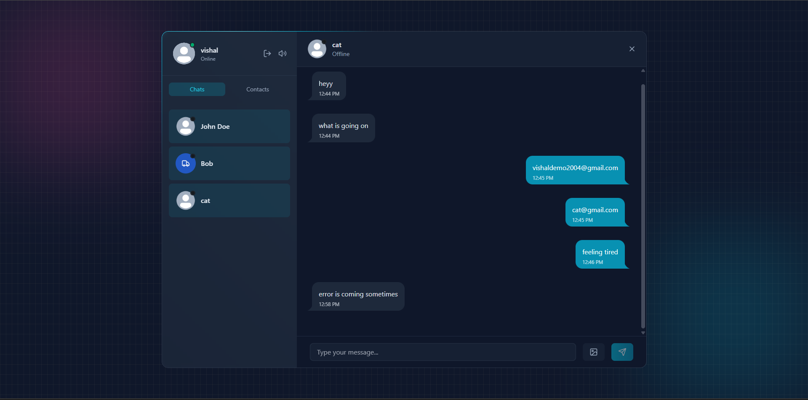

# 🚀 Chatify — Real-Time Chat App (MERN)

A **Full-stack real-time chat application** built using the MERN stack, featuring secure authentication, real-time communication, and modern UI/UX. Designed with scalability, performance, and developer best practices in mind.
---

## ⚡ Features

- 🔐 JWT Authentication (no third-party auth)
- 💬 Real-time messaging (Socket.IO)
- 🟢 Online/Offline presence tracking  
- 🔔 Typing & notification sounds (toggle)
- 🖼️ Image uploads (Cloudinary)
- 📨 Welcome emails (Resend)
- 🚦 API rate limiting (Arcjet)

---

## 🛠️ Tech Stack

**Frontend:** React, Tailwind CSS, DaisyUI, Zustand  
**Backend:** Node.js, Express, MongoDB, Socket.IO  

---
## 📸 Preview

.png)
